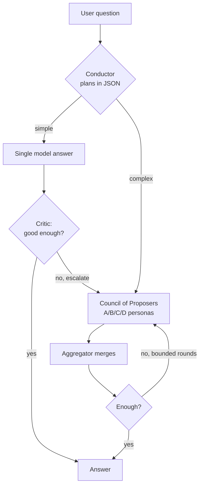

# Fugu-Local — Dynamic Mixture-of-Agents, 100% local on 8 GB VRAM

[](https://github.com/tomato371/fugu-local/actions/workflows/ci.yml)

A local, dependency-light **Mixture-of-Agents (MoA) orchestrator** for LLMs, inspired by
Sakana AI's *Fugu*. It runs entirely on consumer hardware (built and tuned for an
RTX 4060 Laptop, 8 GB VRAM / 48 GB RAM / i7-13700H) using [Ollama](https://ollama.com) —
**no API keys, no cloud, no paid services.**

> **Why this exists.** Classic *static* MoA runs a fixed set of proposer models on every
> query and merges them with a fixed aggregator. The core idea of Fugu is that a
> **Conductor LLM decides dynamically** — *is a single model enough? how many agents, and
> which ones? how many rounds?* This project reimplements that dynamic behavior so cheap
> questions stay cheap and hard questions escalate to full deliberation, all within an
> 8 GB VRAM budget.

## How it works

1. **Plan** — the Conductor reads the question and emits a JSON execution plan
   (single model vs. council, which proposers, how many rounds).
2. **Fast path** — easy questions are answered by one model, skipping MoA overhead.
3. **Escalate** — if a single answer is weak, a Critic detects it and escalates to a council.
4. **Recurse** — if the council's answer is still insufficient, bounded additional rounds run.



The proposer "personas" (A/B/C/D) map to an all-star lineup of local models
(e.g. `gpt-oss:20b`, `qwen3-coder:30b`, `gemma4:26b`) plus a math/physics specialist;
routing is handled by a lightweight `qwen3:4b` Conductor/Critic to keep VRAM residency low.
On 8 GB VRAM, large models run with automatic RAM offload (absorbed by 48 GB RAM).

### Engineering notes (the hard-won 8 GB lessons)
- Talks to Ollama's **native `/api/chat`** via `urllib` (zero deps). The `/v1` OpenAI-compat
  endpoint ignores `num_ctx` and tries to allocate each model's max context (e.g. qwen3's
  262 144), which overflows the KV cache and crashes `llama-server` on 8 GB — `/api/chat`
  lets `options.num_ctx` be pinned per-request to a safe value.
- Console output is reconfigured with `errors="replace"` so Windows `cp932` pipes don't crash
  on symbols like `✓ ⚠ ❌`.

## Features

- 🧠 **Dynamic MoA** — Conductor-planned single/council routing with critic escalation and bounded recursive rounds
- 💻 **Fully local** — Ollama only; no external API, no keys
- 📄 **File I/O** — read from `.txt` / `.pdf` / `.docx`; write answers to `.md` / `.py` / `.pdf` / `.docx` / `.xlsx` / `.html` (format auto-selected by extension)
- 🔎 **Web search** injection (`--search`) and **RAG** over local folders (`--rag ./docs`)
- 💬 **Session memory** — persistent conversation history, per-project sessions
- 🖥️ **Three front-ends** — CLI, a **Gradio web UI** (`fugu_web.py`), and a **TUI** (`fugu_tui.py`)
- 📊 **Benchmark suite** — `bench_fugu.py` / `eval_fugu.py` for accuracy evaluation

## Requirements

- Python 3.10+
- [Ollama](https://ollama.com) running locally (`http://localhost:11434`)
- Pull the models you want to use, e.g.:
  ```bash
  ollama pull qwen3:4b
  ollama pull qwen3-coder:30b
  ollama pull gpt-oss:20b
  ```
- Optional Python libs (only if you use those features):
  `pdfplumber` (read PDF), `fpdf2` (write PDF), `python-docx`, `openpyxl`, `python-pptx`, `gradio` (web UI)

## Quick start

```bash
# Interactive mode
python fugu_local.py

# One-shot question
python fugu_local.py "Is 91 a prime number?"

# Read a task from a file, save the fixed code
python fugu_local.py --file task.py --out fix.py

# With web search
python fugu_local.py --search "What is the latest S&P 500 level?"

# With RAG over a docs folder
python fugu_local.py --rag ./docs "Implement a PINN for this problem"

# Web UI (Gradio)
python fugu_web.py
```

## Run with Docker

Everything runs in containers — no local Python or Ollama install needed
(requires Docker; for GPU, the NVIDIA Container Toolkit).

```bash
# 1. Start Ollama and pull at least the lightweight router model
docker compose up -d ollama
docker compose exec ollama ollama pull qwen3:4b
# (optional — the full council; large downloads)
# docker compose exec ollama ollama pull gpt-oss:20b
# docker compose exec ollama ollama pull qwen3-coder:30b

# 2. Start the web UI, then open http://localhost:7860
docker compose up fugu
```

To run the CLI inside the container instead:

```bash
docker compose run --rm fugu python fugu_local.py "Is 91 a prime number?"
```

## REST API

The orchestrator is also exposed as a small FastAPI service.

```bash
# start the API (Ollama must be running with a model pulled)
pip install fastapi "uvicorn[standard]"
uvicorn fugu_api:app --host 0.0.0.0 --port 8000
# interactive docs: http://localhost:8000/docs

# ask a question
curl -X POST http://localhost:8000/ask \
  -H "Content-Type: application/json" \
  -d '{"question": "Is 91 a prime number?"}'
```

| Method | Path | Purpose |
|---|---|---|
| `GET` | `/health` | Is the Ollama backend reachable? |
| `POST` | `/ask` | Answer a question via the full MoA pipeline |

## Project structure

| File | Purpose |
|---|---|
| `fugu_local.py` | Core orchestrator + CLI (Conductor / Critic / Proposers / Aggregator) |
| `fugu_web.py` | Gradio web front-end |
| `fugu_api.py` | FastAPI REST API (`POST /ask`, `GET /health`) |
| `fugu_tui.py` | Terminal UI front-end |
| `bench_fugu.py` | Benchmark runner (accuracy) |
| `bench_queue.py` | Batch/queue benchmarking |
| `eval_fugu.py` | Evaluation utilities |
| `test_fugu_offline.py` | Offline unit tests (no model required) |
| `Dockerfile` | Container image for the app (web UI by default) |
| `docker-compose.yml` | One-command stack: Ollama + fugu web UI |
| `requirements.txt` | Optional deps (web UI + file I/O); core needs none |

## License

TODO: choose a license (MIT is a common, permissive default).

---

*Built as a study of resource-constrained local LLM orchestration — dynamic MoA that fits in
8 GB of VRAM.*
